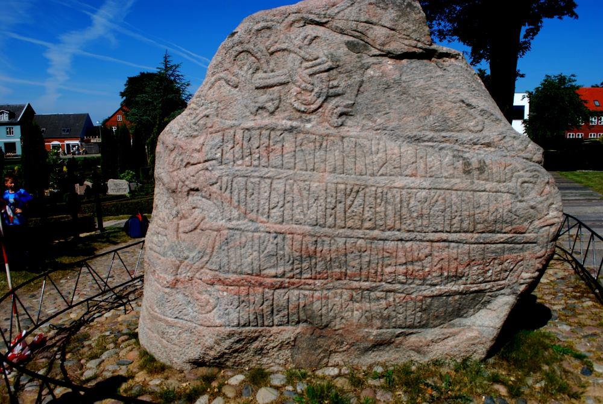
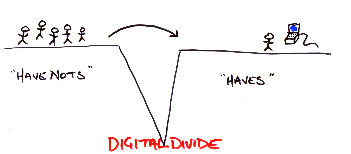
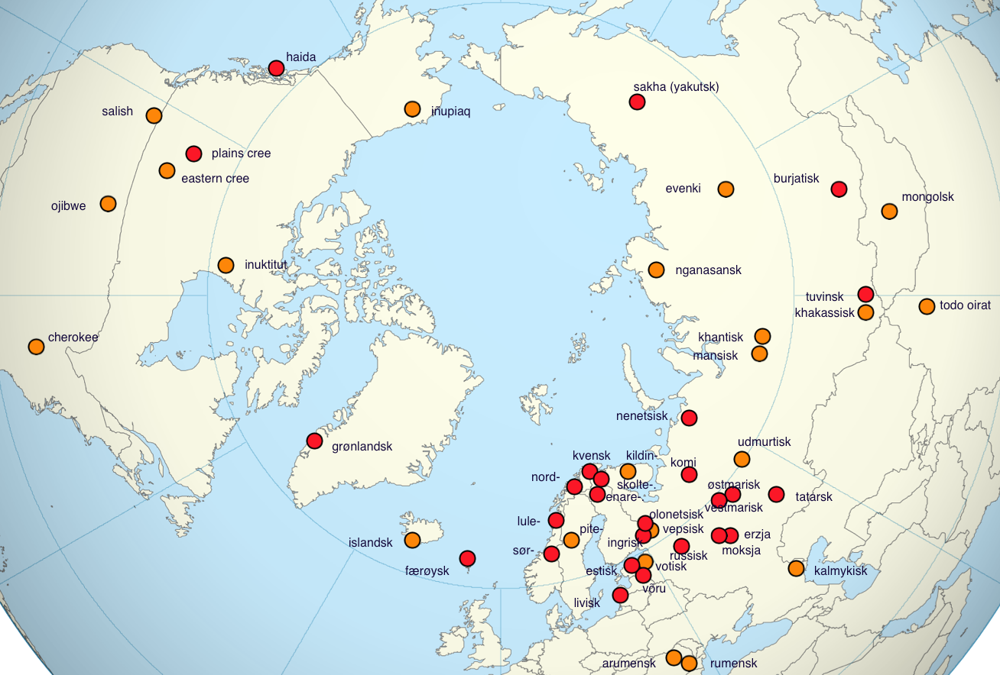
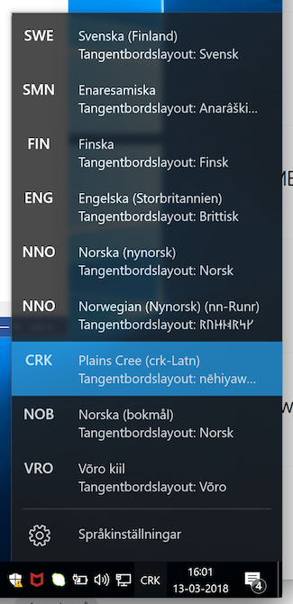
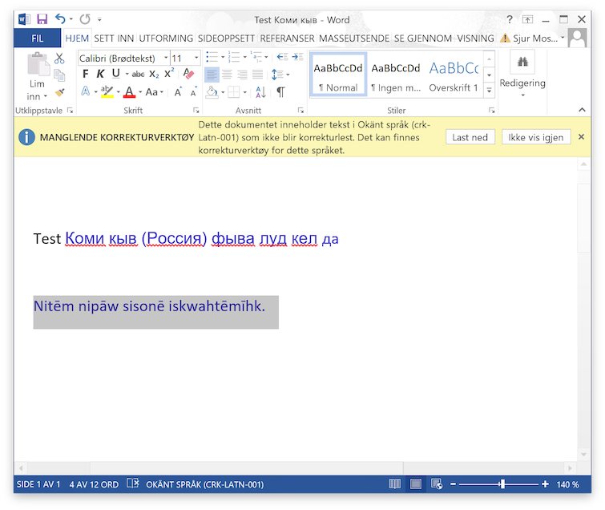
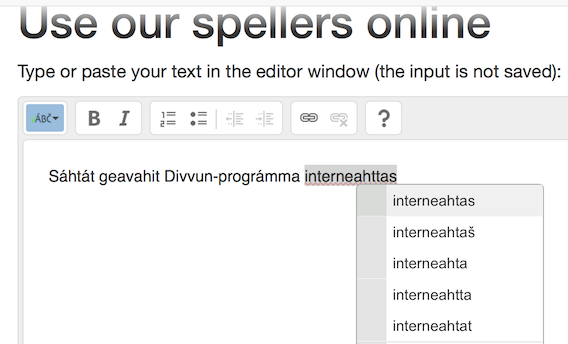
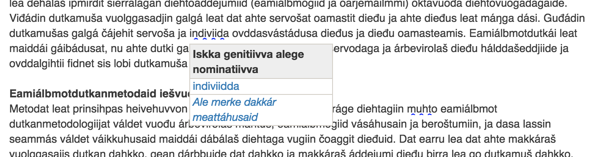
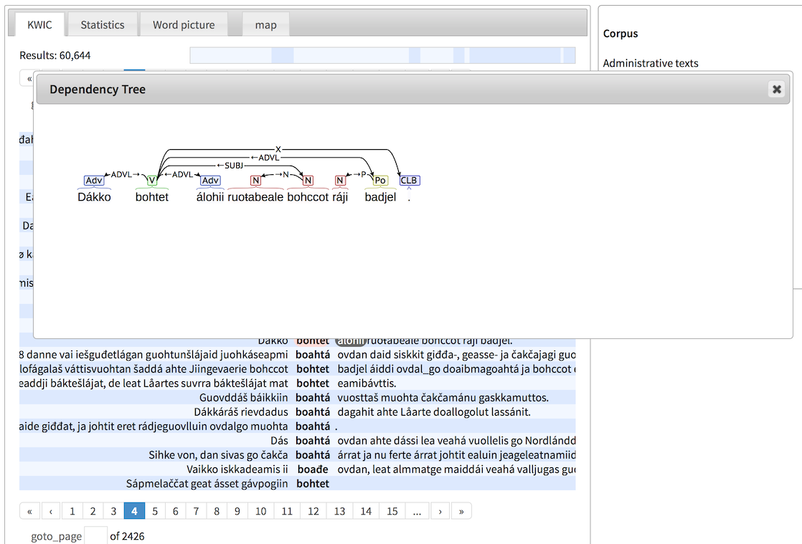

# LT for minority languages & the Giella infrastructure

Main sections:

* introduction
* minority languages and requirements for LT development
* Giella infra
* lexc & twolc as linguistic programming languages
* development
* tools
* demos
* summary

# Introduction

## About me

* Sjur Nørstebø Moshagen
* Linguistics, nordic languages & computer science
* Lingsoft
* Sámi Parliament
* UiT the Arctic University of Norway

## What is language technology

### From cuneiform to speech recognition

The first language technology:


Some later instances of long-lasting language technology:




Today we talk about information technology — Internet a.o.


and the term language technology is restricted to actual processing of language data - be it speech or text or video (as when processing signed languages). The ultimate dream of language technology is speech-to-speech machine translation:


In all cases language (and information) technology has been pretty transformative.

Another typical characteristic of language technology is that it is divisive:

* those with access
* those without



empovering those with access, leaving those without behind. As such it can easily be a driver in language death: to take part in the society at large, you can't use your own language because the society expects use of certain technologies:

* a certain alphabet or writing system — ie literacy
* access to a printing press
* access to computers
* access to your letters on that computer

For most languages of the world (about 7000) this is **not true**, and will only add to all the other factors driving language death.

One of the main objectives of the Giella infrastructure is to help counter this, by developing language technology for such languages, to make them easy to use on digital devices.

Our starting point and main focus is the Sámi languages, but everything that we make is language independent (except for the linguistic data, obviously), and we actively cooperate with other groups to extend the reach of our technology.

# Minority languages and requirements for LT development

## Requirements of minority language development

Typically, minority languages share a number of characteristics:

* few or non-existing digital resources
* restricted availability of dictionaries and grammar, or no at all
* often complex morphology or morphophonology

## Ownership

It is important that language communities have control over language resources relating to their language, in the sense that no private entity can block access to those resources. Otherwise the society will risk vendor lock-in, and expensive redevelopment of existing tools.

The best solution is to ensure that everythig is **open source**.


## Reuse and multiuse

Because of the costs of language technology projects, it is important to build your infra and resources with reuse in mind, and also plan them so that everything is prepared for multiple usage scenarios.

E.g. in the Giella infrastructure, we have standardised conventions that makes it easy to build both normative and descriptive tools from the same codebase.

* **normative:** tools that adhere strictly to an agreed-upon norm for writing, and try to correct text so that deviations are brought in line with the norm, like spelling checkers and grammar checkers.
* **descriptive:** tools that try to process all texts in a language, irrespective of the normative properties of the text

## Mainly rule-based

Language technology comes in several flavours:

* rule-based
* statistical
* stocastic
* neural-nets

Typical of all but the rule-based one is that they require large amounts of raw data to be trained on.

Rule based technologies on the other hand, in principle only requires a mother tongue speaker / linguist.


## Main sources for building the grammars and language resources

* digital dictionaries
* grammars
* korpus
* native speakers

# The Giella infrastructure

* language independent infrastructure
* scalability in two dimensions: languages x tools/products
* standardised dir & file structure
* encourages and fascilitates international cooperation
* ~100 languages in our infra (at various stages), 30+ in active development
    * almost all of them minority languages
    * majority language grammars and LT resources only to support the minority languages



## Standardised dir structure

Every language has the following directory structure:

```
.
├── am-shared
├── devtools
├── doc
│   └── resources
├── m4
├── misc
├── src
│   ├── filters
│   ├── hyphenation
│   ├── morphology
│   ├── orthography
│   ├── phonetics
│   ├── phonology
│   ├── syntax
│   ├── tagsets
│   └── transcriptions
├── test
│   ├── data
│   ├── src
│   └── tools
└── tools
    ├── data
    ├── grammarcheckers
    ├── hyphenators
    ├── mt
    ├── shellscripts
    ├── spellcheckers
    └── tokenisers
```

## Scalability

* for languages:
    * template for all resources needed
* for tools:
    * add support for a new tool to the template, and propagate it to all existing languages
* core design principle:
    * separate language independent processing from language-specific processing

The templating system and the split between language independent and specific code ensures that we can add as many languages as we want, and easily add support for new tools and technologies.

# «Linguistic programming»

Formalisms / technologies used:

* **morphology / morphophonology:** Hfst / Foma / Xerox
    * lexc
    * twolc
    * xfst rewrite rules
* **syntax:** Constraint grammar (in the form of *VISLCG3* )

All of these are open source except for the Xerox tools (which are free, though). Foma does not support TwolC (see further down).

## LexC

* an excellent formalism for concatenative morphology
* typically, you specify stems and affixes in different lexicons
* ... to allow for abstractions over stem classes and inflections
* it is in essence a programming language for linguists
* ... where you spell out the morphology of a language such that a compiler can turn it into an executable program (at least with the help of a run-time engine)

## TwolC

* Formalism developed by Kimmo Koskenniemi in the early 80's to describe phonological processes
* resembles quite closely generative rewrite rules of the form `A -> B / C _ D`
* rules are unordered and applied in parallel

## Xfst rewrite rules

* another formalism to describe phonology
* main difference to TwolC: rules are ordered and applied in sequence

Both TwolC and Xfst rewrite rules are supported by the Giella infrastructure, compilation support is dependent on the compiler tool used: Foma does not support Twolc, everything else is supported by all tools.

## Constraint grammar

* formalism developed at Helsinki university by Fred Karlsson, later extended by Tapanainen (CG2) and the VISL project (CG3)
* main idea is to remove or select specific possible readings of ambiguous words given context constraints:
    * in the context of a subject personal pronoun, select a verb reading that agrees with the pronoun in person and number
* used a lot in text parsers in combination with morphological analysers, giving very good results
* also used in language technology tools and products such as machine translation and grammar checking

## Testing

Systematic testing is essential, and the infrastructure supports several types of tests:

* classes of words/inflections/alternations
* lemmas
* in-source test data

Example test data:

```
Tests:

  Verb - båetedh: # verb I, stem -ie, root vowel -åe-
    båetedh+V+IV+Inf: båetedh
    båetedh+V+IV+Ind+Prs+Sg1: båatam
    båetedh+V+IV+Ind+Prs+Sg2: båatah
    båetedh+V+IV+Ind+Prs+Sg3: båata
    båetedh+V+IV+Ind+Prs+Du1: båetien
    båetedh+V+IV+Ind+Prs+Du2: [båeteden, båetiejidien]
    båetedh+V+IV+Ind+Prs+Du3: båetiejægan
    båetedh+V+IV+Ind+Prs+Pl1: [båetebe, båetiejibie]
    båetedh+V+IV+Ind+Prs+Pl2: [båetede, båetiejidie]
    båetedh+V+IV+Ind+Prs+Pl3: båetieh
```

This can be used both as a development gold standard, and as regression testing later.

# Tools

## keyboards (desktop & mobile)

A very simple syntax (mobile keyboard shown):

```
modes:
  mobile-default: |
    á š e r t y u i o p ŋ
    a s d f g h j k l đ ŧ
       ž z č c v b n m
  mobile-shift: |
    Á Š E R T Y U I O P Ŋ
    A S D F G H J K L Đ Ŧ
       Ž Z Č C V B N M
```

This + a few more technical details is used to produce ready-to-use installers.

### Locale registration

As part of the desktop keyboard installers, the locale of the keyboard is added to the system, so that languages unknown to Windows and macOS is subsequently known and can be used for spell checking:





## spellers

A speller is made up of two parts:

1. an acceptor - is this a word or not?
1. an error model - if this is not a word, how is it most likely to be corrected?

In our infrastructure, both are finite state transducers. The acceptor is built from our general analyser, but restricted to only normatively correct forms.

### Short turnaround during development

1. add a word, correct some part of the morphology
1. compile
1. test in e.g. LibreOffice or on the command line

Compilation time varies a lot depending on the language and the size and complexity of the lexicon, the morphology and the morphophonology.

### Host app integration

* MS Word (Windows)
* LibreOffice
* InDesign
* web server



## hyphenation

* uses rewrite rules to identify syllable structure = hyphenation points
* uses analyser (lexicon) to find word boundaries and exceptional hyphenation

## grammar checkers

* morphological analyser for analysis and tokenisation
* includes disambiguation of multiword expressions
* a tagger for whitespace errors
*  runs the spelling checker on unknown words
* constraint grammars for both disambiguation and error detection, as well as for selecting or filtering speller suggestions based on context
* uses valency info and semantic tags to avoid reliance on (faulty) morphology and syntax
* new research comming out of this:
  * improvements to sentence detection (near-perfect results possible)
  * improvements to tokenisation and whitespace handling - we can detect compounds erroneously written apart (not very well handled or not at all by most other grammar checkers)

Works in:

* LibreOffice
* MS Word (web version for now, Win and Mac coming soon)
* GoogleDocs
* Online demo (password protected)
* planned support: macOS (system wide), possibly Windows

Screen shot from LibreOffice:


## text-to-speech systems

* recordings and text available
* technology unfortunately from a commercial company = closed source code
* quality very good
* the original plan was to use our own text processing for conversion to IPA/SAMPA/whatever,
  and we still plan to do that
* we also plan to build a fully open-source text-to-speech system based on Edinburgh technology
* the idea is to use roughly the same text processing as we use for the grammar checker to produce a phonetic transcription, and feed that to the synthesis engine

DEMO

## dictionaries

* content from several sources
* morphological analysis to enable looking up directly in text
    * web browsers
    * macOS and Windows apps


## language learning

* analysing reader input
* adapting suggested forms according to user preferences

## Korp

* database and interface for searching a parsed corpus
* morphological analysis, disambiguation, syntactic parsing using our tools
* corpus data available in many languages



# Summary

* one source for everything
* reuse and multiple usages
* summarised in the following illustration:


