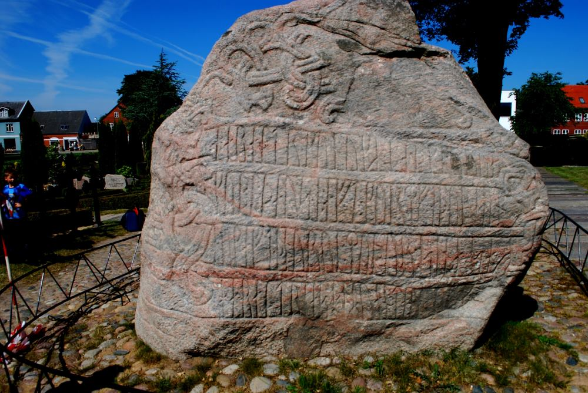
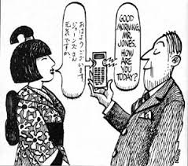
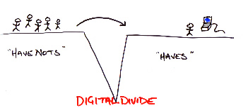
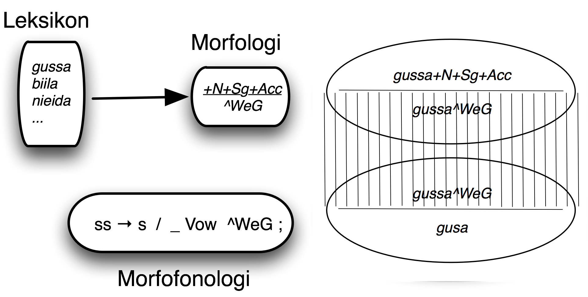
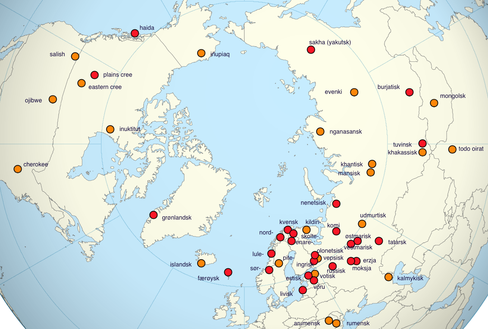

# LT for minority languages & the Giella infrastructure

Main sections:

* introduction
* minority languages and requirements for LT development
* Giella infra
* lexc & twolc as linguistic programming languages
* development
* tools
* demos
* summary

# Introduction

## About me

* Sjur Nørstebø Moshagen
* Linguistics, nordic languages & computer science
* Lingsoft
* Sámi Parliament
* UiT the Arctic University of Norway

## What is language technology

### From cuneiform to speech recognition

The first language technology:

Some later instances of long-lasting language technology:

Today we talk about information technology — Internet a.o.

and the term language technology is restricted to actual processing of language data - be it speech or text or video (as when processing signed languages). The ultimate dream of language technology is speech-to-speech machine translation:

In all cases language (and information) technology has been pretty transformative.

Another typical characteristic of language technology is that it is divisive:

* those with access
* those without

empovering those with access, leaving those without behind. As such it can easily be a driver in language death: to take part in the society at large, you can't use your own language because the society expects use of certain technologies:

* a certain alphabet or writing system — ie literacy
* access to a printing press
* access to computers
* access to your letters on that computer

For most languages of the world (about 7000) this is **not true**, and will only add to all the other factors driving language death.

One of the main objectives of the Giella infrastructure is to help counter this, by developing language technology for such languages, to make them easy to use on digital devices.

Our starting point and main focus is the Sámi languages, but everything that we make is language independent (except for the linguistic data, obviously), and we actively cooperate with other groups to extend the reach of our technology.

# Minority languages and requirements for LT development

## Requirements of minority language development

Typically, minority languages share a number of characteristics:

* few or non-existing digital resources
* restricted availability of dictionaries and grammar, or no at all
* often complex morphology or morphophonology

## Ownership

It is important that language communities have control over language resources relating to their language, in the sense that no private entity can block access to those resources. Otherwise the society will risk vendor lock-in, and expensive redevelopment of existing tools.

The best solution is to ensure that everythig is **open source**.

## Reuse and multiuse

Because of the costs of language technology projects, it is important to build your infra and resources with reuse in mind, and also plan them so that everything is prepared for multiple usage scenarios.

E.g. in the Giella infrastructure, we have standardised conventions that makes it easy to build both normative and descriptive tools from the same codebase.

* **normative:** tools that adhere strictly to an agreed-upon norm for writing, and try to correct text so that deviations are brought in line with the norm, like spelling checkers and grammar checkers.
* **descriptive:** tools that try to process all texts in a language, irrespective of the normative properties of the text

## Mainly rule-based

Language technology comes in several flavours:

* rule-based
* statistical
* stocastic
* neural-nets

Typical of all but the rule-based one is that they require large amounts of raw data to be trained on.

Rule based technologies on the other hand, in principle only requires a mother tongue speaker / linguist.

## Main sources for building the grammars and language resources

* digital dictionaries
* grammars
* korpus
* native speakers

# The Giella infrastructure

* language independent infrastructure
* scalability in two dimensions: languages x tools/products
* standardised dir & file structure
* encourages and fascilitates international cooperation
* ~100 languages in our infra (at various stages), 30+ in active development
    * almost all of them minority languages
    * majority language grammars and LT resources only to support the minority languages

## Scalability

* for languages:
    * template for all resources needed
* for tools:
    * add support for a new tool to the template, and propagate it to all existing languages
* core design principle:
    * separate language independent processing from language-specific processing

The templating system and the split between language independent and specific code ensures that we can add as many languages as we want, and easily add support for new tools and technologies.

# «Linguistic programming»

Formalisms / technologies used:

* **morphology / morphophonology:** Hfst / Foma / Xerox
    * lexc
    * twolc
    * xfst rewrite rules
* **syntax:** Constraint grammar

## LexC

* word-and-paradigm
* “lexc är ett programmeringsspråk för att skriva morfologiska lexikon med”
* full-size lexicon
* testing

Systematic testing of:

* classes of words/inflections/alternations
* lemmas

# Tools

* keyboards (desktop & mobile)
    * locale registration
* spellers
* hyphenation
* grammar checkers
* text-to-speech systems
* dictionaries
* language learning
* Korp
* tool integration into host applications

* Summary
